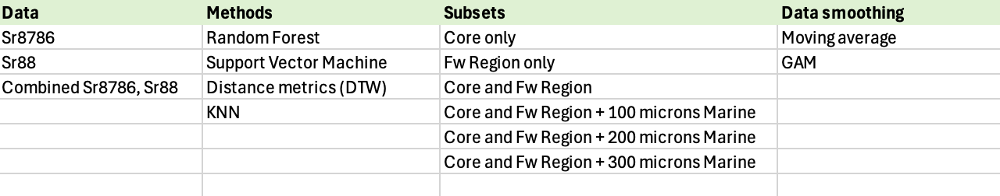

# Timeseries Analysis of ICPMS data

## 1. Data Cleaning and preprocessing

Raw data aready has clean column names, values, etc. and includes selected natal origin locations. To prepare for timeseries analysis "Landmark" Markers are added and all data is loaded into a master metadata sheet. The "Core" region begins at a manually selected spot and goes until the beginning of the selected natal origin region. "Fw" is from the beginning of the natal origin region until immediately following the spike in Sr88 associated with marine entry. This location is selected by assessing the gradient values and selecting the index in which gradient falls below \*\* insert value \*\* after a steep and sustained positive gradient in the second half of the timeseries data. Preforming this aromatically ensures this spot is chosen consistantly among all individuals and does not contain human error associated with manual selection. All points following this selected index are considered "Marine".

### QC:

Manual QC of all time-series is preformed to verify that selection of landmarks are reasonable and consistant with all timeseries. Individuals with errors in Landmark assignment or quality of the raw data are removed.

The "Core" region of the otolith may be an important feature for classification, as has been suggested in (list citations). However, sample preparation and analysis does not always include the core region. To assess the impact including this region (and including it with complete resolution) an additional QC step assigned a value of "No", "Partial", or "Yes" based on the quality of the core region after visual examination.

### **Interpolation and region selection:**

Several subsets of the data are selected for analysis including several combinations of landmark features and adjustments to additional microns to be included. For example, an analysis may consider the freshwater region (natal origin -\> marine) + 200 microns.

For all analysis, the region is selected, the average number of reads within this region is calculated for the entire dataset, and all timeseries are interpolated to this length using \*\*description here \*\*. Doing so allows for several robust classification techniques to be used which require the data all be the same length.

## 2. Testing the classification success of timeseries.

On a testing set ( 20% of the full dataset), we assessed:

**Overall classification success rate** (*proportion of full testing set correctly classified*)

**Per-class sensitivity rate** (*proportion of each watershed correctly identified*)

**Per-class specificity rate** ( rate of type II error, i.e. rate at which classes are correctly identified as NOT belonging to the given class )

## **3. Model Results**

# Otolith Morphological Analysis

### 1. Otolith outline extraction

Photos of otoliths from known watersheds were taken using a microscope camera. Outlines were extracted using ExtractOtolithOutlines() from the {ShapeR} package, which is specifically designed to analyze otolith shapes. In addition to extracting detailed outlines, this function also produced diagnostic figures showing the extracted outline. After extraction, manual QC was conducted on these photos and erronous samples were removed from the dataset.

### 2. Fourier transformation
